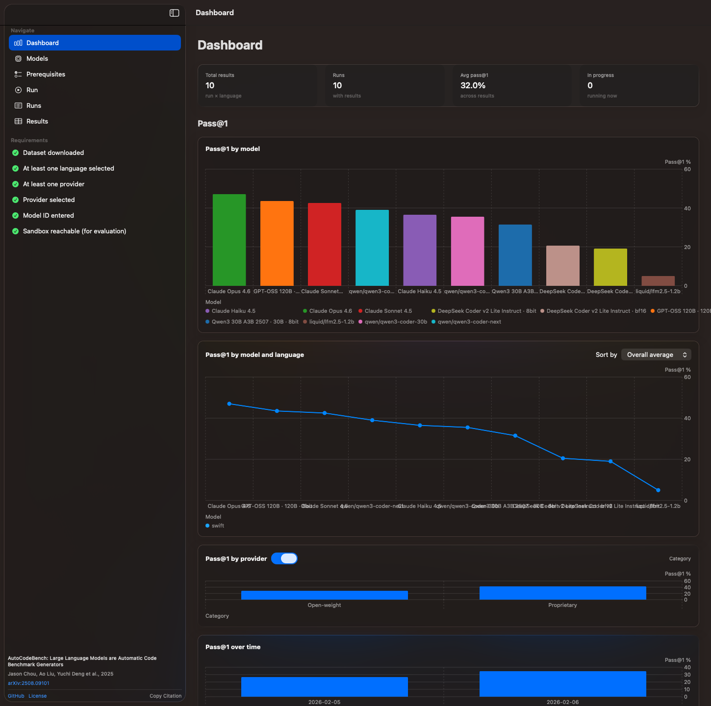
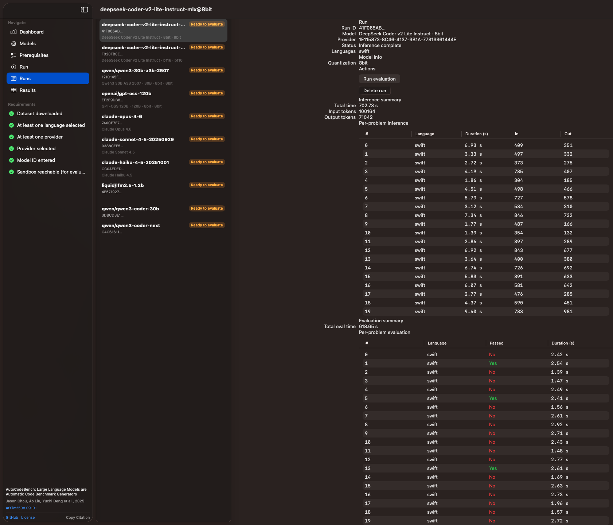
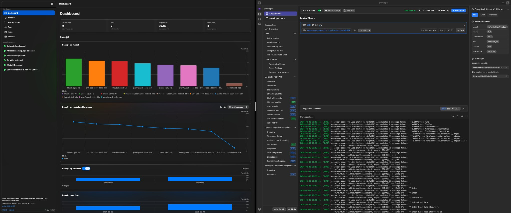

# AutoCodeBench

A macOS app for benchmarking code-generation LLMs using the [AutoCodeBench](https://github.com/Tencent-Hunyuan/AutoCodeBenchmark) dataset with automated sandbox evaluation.

## Overview

AutoCodeBench lets you run inference with multiple providers (Anthropic, OpenAI, OpenRouter, LM Studio, Ollama, and custom endpoints), evaluate model outputs against the AutoCodeBench test suite via a Docker sandbox, and view results in a dashboard with pass@1, timing, and token usage.

## Screenshots

| Dashboard — summary stats and Pass@1 charts (by model, language, provider, over time) | Runs — inference list and run detail (per-problem inference and evaluation) |
|----------------------------------------------------------------------------------------|-----------------------------------------------------------------------------|
|                                                 |                       |

| Dashboard with developer view (local server, loaded models, inference logs) |
|----------------------------------------------------------------------------|
|    |

## Features

- **Multi-provider inference** — Configure API keys and base URLs for Anthropic, OpenAI, OpenRouter, LM Studio, Ollama, or a custom endpoint
- **Resumable runs** — Pause and resume runs; inference skips problems that already have output
- **Sandbox evaluation** — Automatic evaluation using the [MultiLanguageSandbox](https://github.com/Tencent-Hunyuan/AutoCodeBenchmark) Docker image (full and demo tests)
- **Results dashboard** — Charts and statistics: pass@1 by model, language, provider; timing and token efficiency
- **Dataset management** — Download the AutoCodeBench dataset (JSONL) from Hugging Face; select languages and problems per run

## Requirements

- **macOS 26.0+**
- **Xcode 26+** (Swift 6.2)
- **Docker** — For sandbox evaluation (e.g. `hunyuansandbox/multi-language-sandbox:v1` on port 8080). Optional if you only run inference and evaluate elsewhere.

## Getting Started

### Clone the repository

```bash
git clone https://github.com/gingofthesouth/AutoCodeBenchApp.git
cd AutoCodeBenchApp
```

### Build and run in Xcode

1. Open the workspace in Xcode (use the workspace, not the project):
   ```bash
   open AutoCodeBench.xcworkspace
   ```
2. Select the **AutoCodeBench** scheme.
3. Build and run (**⌘R**).

### First-time setup in the app

1. **Prerequisites** — Download the AutoCodeBench dataset (via the app or the bundled script). Ensure Docker is running if you want in-app evaluation.
2. **Providers** — Add API keys or base URLs for your chosen inference providers in **Providers**.
3. **Run** — Create a run (model, languages, temperature, max tokens), start inference, then evaluate when inference completes (or use streaming evaluation).

## Usage

- **Dashboard** — Summary stats and charts across runs.
- **Models** — List available models per provider.
- **Prerequisites** — Dataset download and sandbox diagnostics (Homebrew, Docker, Colima, sandbox image).
- **Run** — Configure and start a run; pause/resume or delete.
- **Runs** — List runs and open run details.
- **Results** — Per-run results, per-problem pass/fail, and performance metrics.

Run state and outputs are stored under `~/Library/Application Support/AutoCodeBench/` (runs, dataset cache, results database, provider config). Provider API keys are stored there and are not committed to the repo.

## Project Architecture

The app uses a **workspace + SPM package** layout:

```
AutoCodeBenchApp/
├── AutoCodeBench.xcworkspace     # Open this in Xcode
├── AutoCodeBench.xcodeproj       # App shell project
├── AutoCodeBench/                # App target (entry point, assets)
├── AutoCodeBenchPackage/         # SPM package — feature code
│   ├── Package.swift
│   ├── Sources/AutoCodeBenchFeature/   # Views, services, models
│   └── Tests/AutoCodeBenchFeatureTests/
├── AutoCodeBenchUITests/         # UI tests
└── Config/                       # XCConfig and entitlements
```

The app target is minimal; most code lives in the `AutoCodeBenchFeature` package.

## AutoCodeBench dataset and sandbox

This app is built around the dataset and evaluation pipeline from:

**[Tencent-Hunyuan/AutoCodeBenchmark](https://github.com/Tencent-Hunyuan/AutoCodeBenchmark)**

- **Dataset** — AutoCodeBench (e.g. `autocodebench.jsonl` from [Hugging Face](https://huggingface.co/datasets/tencent/AutoCodeBenchmark)); used for problem text, canonical solutions, and test functions.
- **Sandbox** — [MultiLanguageSandbox](https://github.com/Tencent-Hunyuan/AutoCodeBenchmark) (`hunyuansandbox/multi-language-sandbox:v1`) for running and evaluating code in many languages. The app sends solutions to the sandbox and interprets pass/fail from the response.

See the [AutoCodeBenchmark README](https://github.com/Tencent-Hunyuan/AutoCodeBenchmark) for dataset details, evaluation protocol, and citation.

## Acknowledgements

- **Tencent Hunyuan** — For the [AutoCodeBenchmark](https://github.com/Tencent-Hunyuan/AutoCodeBenchmark) dataset, evaluation methodology, and MultiLanguageSandbox.
- **XcodeBuildMCP** — Project was scaffolded with [XcodeBuildMCP](https://github.com/cameroncooke/XcodeBuildMCP) for macOS/Xcode build and test workflows.

## License

See the [LICENSE](LICENSE) file in this repository.
